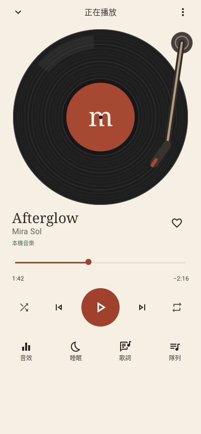
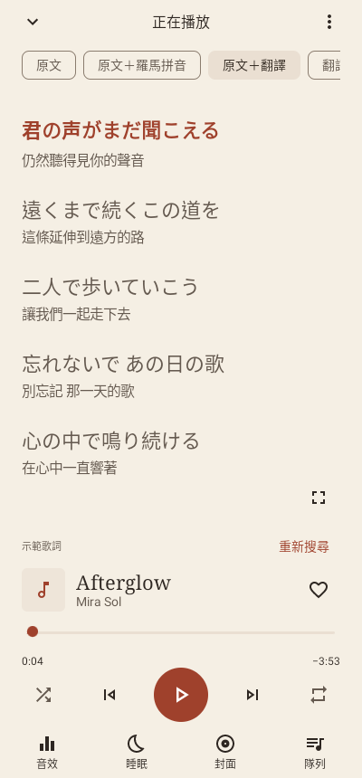
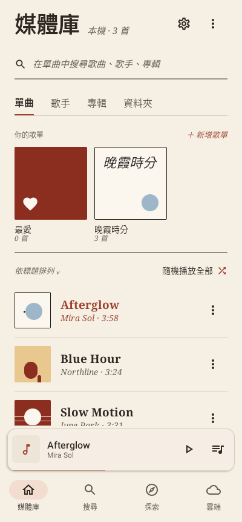
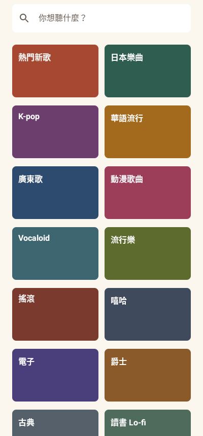
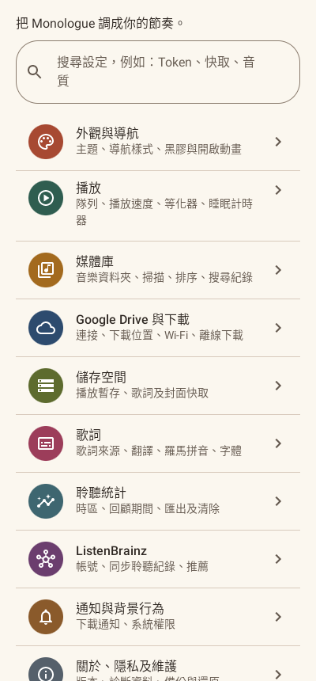
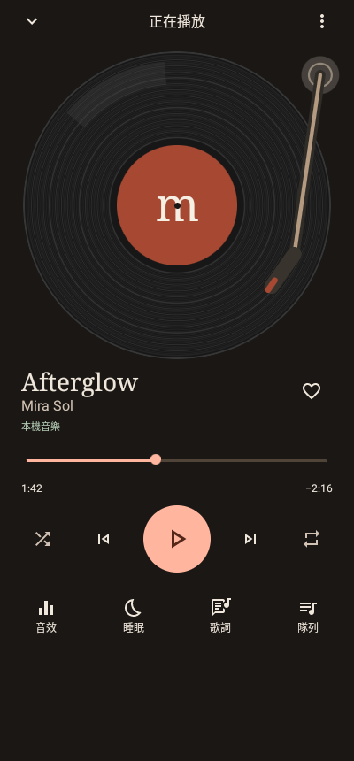

<div align="center">


# Monologue

**A warm, vinyl-style music player for Android.**<br>
Your own music — from your phone and Google Drive — with synced lyrics, romaji and translations.

[](https://github.com/HKmario852/monologue/releases/latest)
[](https://github.com/HKmario852/monologue/releases)


[](LICENSE)

**English** | [繁體中文](docs/i18n/README.zh-TW.md) | [简体中文](docs/i18n/README.zh-CN.md) | [日本語](docs/i18n/README.ja.md) | [한국어](docs/i18n/README.ko.md) | [Español](docs/i18n/README.es.md)

&nbsp;
&nbsp;


</div>

## ✨ Features

- **🎵 Your library** — songs, artists, albums and folders on your phone, plus playlists, favourites and a queue.
- **☁️ Google Drive** — browse your music on Drive, stream it, or download it for offline listening.
- **📝 Lyrics** — synced lyrics that scroll with the song; Japanese lyrics with on-device romaji; human-made Chinese translations found automatically, with on-device machine translation as a fallback; full-screen lyrics.
- **🔎 Search & discover** — one search box for your library, Drive and online music, plus YouTube Music categories.
- **📊 Listening recap** — your top songs by week, month or all time, and optional ListenBrainz scrobbling.
- **🎚️ Playback** — equalizer, sleep timer, silence between songs, and resume after a call or another app's video.
- **🎨 Design** — warm paper and dark themes, a spinning record, and a 3-second animated intro (can be turned off).
- **⬆️ In-app updates** — new versions from GitHub Releases, checked against SHA-256 and the app's signature.

> [!NOTE]
> The app's interface is in Traditional Chinese for now.

## 📥 Download

1. Download `monologue-x.y.z.apk` from **[Releases](https://github.com/HKmario852/monologue/releases/latest)** and install it (Android 8.0 or later).
2. Later versions install from inside the app: **設定 (Settings) › App 更新 (App updates)**.

<details>
<summary><b>More screenshots</b></summary>
<br>
<p align="center">
&nbsp;
&nbsp;

</p>
<p align="center"><sub>All screenshots use demo songs and lyrics.</sub></p>
</details>

## 📝 Lyrics sources

Online lyrics are off until you turn them on. Choose and order the sources in **設定 › 歌詞**.

| Source | What it gives | Default |
|---|---|---|
| [LRCLIB](https://lrclib.net) | Synced lyrics (public library) | On |
| [VocaDB](https://vocadb.net) | Vocaloid and doujin songs; romaji, translations (public API) | Off |
| [THBWiki](https://thwiki.cc) | Touhou doujin songs; synced lyrics and Chinese translations (CC BY-NC-SA) | Off |
| NetEase Cloud Music | Synced lyrics, Chinese translations, romaji (unofficial) | Off |
| Bahamut, Kanogoma | Fan-made Chinese translations (unofficial, reads web pages) | Off |
| J-Lyric, UtaTen | Plain lyrics, romaji (unofficial, reads web pages) | Off |

Romaji is generated on the phone with [Kuromoji](https://github.com/atilika/kuromoji); machine translation runs on the phone with [ML Kit](https://developers.google.com/ml-kit/language/translation).

## 🛠️ Build from source

You need JDK 17 and the Android SDK (platform 35).

```bash
./gradlew :app:assembleDebug        # debug build
./gradlew :app:assembleRelease      # what Releases publish
./gradlew :app:testDebugUnitTest    # unit tests
```

On Windows use `gradlew.bat`. The APKs are in `app/build/outputs/apk/`. CI runs the unit tests and lint on every pull request; release signing is described in [docs/DEVELOPMENT.md](docs/DEVELOPMENT.md).

**Google Drive** needs your own Google Cloud project (Drive API and an Android OAuth client for `io.hkmario.monologue` with your signing key's SHA-1). The published app's Google sign-in is still in testing, so only accounts added as test users can connect. See [docs/DEVELOPMENT.md](docs/DEVELOPMENT.md) (in Chinese) for the full setup and architecture notes.

## 🧱 Built with

[Kotlin](https://kotlinlang.org) · [Jetpack Compose](https://developer.android.com/compose) (Material 3) · [Media3 / ExoPlayer](https://developer.android.com/media/media3) · [Room](https://developer.android.com/jetpack/androidx/releases/room) · [WorkManager](https://developer.android.com/jetpack/androidx/releases/work) · [OkHttp](https://square.github.io/okhttp/) · [Coil](https://coil-kt.github.io/coil/) · [NewPipe Extractor](https://github.com/TeamNewPipe/NewPipeExtractor) · [Kuromoji](https://github.com/atilika/kuromoji) · [ML Kit](https://developers.google.com/ml-kit)

## 🔒 Privacy

No ads and no sign-up. Online features (Drive, lyrics, ListenBrainz) only send data after you turn them on. Details: [docs/PRIVACY.md](docs/PRIVACY.md) (in Chinese).

## ⚠️ Disclaimer

Monologue is a personal, non-commercial project and is not affiliated with Google, YouTube or any lyrics site. Online audio comes from YouTube through NewPipe Extractor, and the unofficial lyrics sources read public web pages; they may stop working at any time and may not follow those services' terms. Lyrics and translations belong to their authors and translators.

## 📄 License

[GPL-3.0-or-later](LICENSE). Third-party licenses: [THIRD_PARTY_NOTICES.md](THIRD_PARTY_NOTICES.md) and [licenses/](licenses/).

Thanks to [LRCLIB](https://lrclib.net), [VocaDB](https://vocadb.net), [THBWiki](https://thwiki.cc), [MusicBrainz](https://musicbrainz.org), [ListenBrainz](https://listenbrainz.org), [NewPipe](https://newpipe.net) and every translator whose work shows up in the lyrics.
