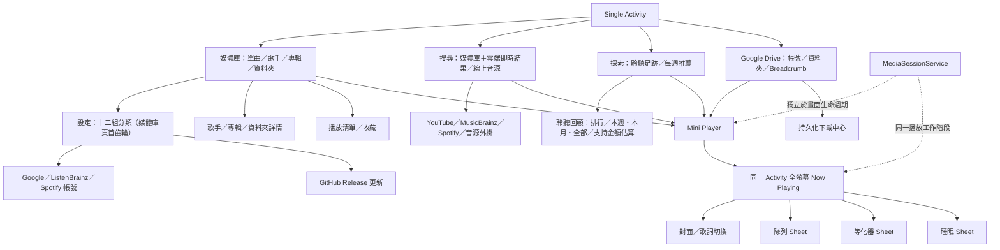

# Monologue 開發者說明

暖白黑膠 Android 音樂播放器的開發與架構筆記（繁體中文）。使用說明見 [README](../README.md)；各版本變更見 [Releases](https://github.com/HKmario852/monologue/releases)。

## 安裝與更新

1. 到 [Releases](https://github.com/HKmario852/monologue/releases/latest) 下載 `monologue-*.apk` 安裝。
2. 之後在 App「設定 › App 更新 › 檢查更新」即可下載新版；更新檔會核對 SHA-256、套件名稱與簽署後才交由 Android 安裝。
3. 更新只接受相同簽署的 APK。

## 視覺及資訊架構

採用參考②的媒體庫列表、水平播放清單、Mini Player、大型圓形黑膠及右側固定唱臂；使用參考③的暖白、赤陶色、深啡文字與編輯式襯線字體。App 名稱為 `Monologue`。沒有把概念編號、年份、標語或概念稿封套帶入 App。

四個主目的地為媒體庫、搜尋、探索、雲端；「設定」由媒體庫頁首的齒輪（或 Drawer）進入，不佔底部分頁。搜尋在輸入時即時列出媒體庫及雲端歌曲，線上音源只在按下搜尋後才查詢。導航預設 Bottom Bar；Drawer 使用相同 NavController 和目的地。切換外觀不重建播放服務。主頁切換採 `launchSingleTop / saveState / restoreState`。返回先關閉 Sheet／Dialog／Drawer；Drive 再回上一個資料夾；全螢幕播放頁返回原頁與列表位置。Now Playing 是 `playing` 導航目的地，不是 Dialog 或第二個 Activity。

## 建置

需求：Android Studio、JDK 17 或相容 JDK、Android SDK Platform 35、Build Tools 35.0.0。最低 Android 8.0（API 26）；target SDK 35。這是明確固定的穩定版本組合，沒有宣稱為最新版本。

1. 用 Android Studio 開啟此目錄，讓 IDE 設定本機 `local.properties`。
2. Windows：`gradlew.bat :app:assembleDebug :app:testDebugUnitTest :app:lintDebug`
3. macOS／Linux：`chmod +x gradlew`，然後 `./gradlew :app:assembleDebug :app:testDebugUnitTest :app:lintDebug`
4. 已連接 Android 裝置或模擬器：`gradlew.bat :app:connectedDebugAndroidTest`
5. APK 位於 `app/build/outputs/apk/debug/app-debug.apk`。

本次交付的 APK 在 Mario 已確認完成 Cloud 設定的前提下，以 `-PgoogleAuthConfigured=true` 建置；解壓來源時若要重現同一入口狀態，須在上述 Gradle 指令附上此 property。省略時 Google Drive 顯示未配置，不會冒充已授權。Spotify 尚未有 Client ID，設定步驟見 [0.2 功能說明](EXPANSION-0.2.md)。

SDK／JDK 的機器特定路徑不屬於可攜來源封裝。GitHub Releases 上的 APK 以 `gradlew.bat :app:assembleRelease` 建置（不可除錯、不縮減程式碼），並以與先前版本相同的簽章簽署，讓 App 內更新可直接安裝。

### 簽署金鑰

所有已發佈版本都以發佈用電腦的 `%USERPROFILE%\.android\debug.keystore` 簽署（憑證 SHA-256 記錄在 `gradle.properties` 的 `releaseCertSha256`），Google 登入的 OAuth client 亦登記咗呢把金鑰。**請備份呢個檔案**：遺失後已安裝的 App 無法再更新，Google 登入亦要重新登記。

- 本機：沒有 `keystore.properties` 時，release 建置沿用 debug 設定，即同一把金鑰。
- CI：執行一次 `scripts/setup-release-signing.ps1`，會先核對憑證 SHA-256，再把金鑰放入 GitHub Secrets（`MONOLOGUE_KEYSTORE_*`）。之後 `main` 的 CI 會建置 release APK 並檢查簽署憑證；Pull Request 只跑單元測試及 lint。
- 儀器測試（`connectedDebugAndroidTest`）需要實機或模擬器，只在本機執行。

| 依賴 | 固定版本 |
|---|---|
| AGP／Gradle | 8.10.1／8.11.1 |
| Kotlin／Compose compiler plugin | 2.1.20／2.1.20 |
| KSP | 2.1.20-1.0.32 |
| Compose BOM | 2025.04.01 |
| Activity／Lifecycle／Navigation | 1.10.1／2.9.0／2.8.9 |
| Room／DataStore／WorkManager | 2.7.2／1.1.7／2.10.1 |
| Media3 | 1.7.1（所有 Media3 模組一致） |
| Google Play services auth | 21.3.0 |
| Coroutines／immutable collections | 1.10.2／0.3.8 |
| OkHttp／Coil | 4.12.0／2.7.0 |
| NewPipe Extractor／desugar NIO | v0.26.5／2.1.5 |

選版核對：[AGP 8.10 相容表](https://developer.android.com/build/releases/agp-8-10-0-release-notes)、[Compose BOM 對應](https://developer.android.com/develop/ui/compose/bom/bom-mapping)、[Room](https://developer.android.com/jetpack/androidx/releases/room)、[Media3](https://developer.android.com/jetpack/androidx/releases/media3)、[WorkManager](https://developer.android.com/jetpack/androidx/releases/work)。實際解析及建置結果見驗證報告。

## 預覽

`app/src/debug/.../ui/Previews.kt` 有 Android Studio 可執行的媒體庫、黑膠、Drive 未設定及設定頁 Preview。`PreviewFixtures` 明確只用於設計／測試；不會寫入正式資料庫，release source set 不包含該檔案。初次啟動的正式 App 是空媒體庫，要求音樂權限或授權資料夾。

交付的 `previews/v0.2` 圖像來自實際 Compose／MuMu 渲染；媒體庫及黑膠設計預覽的曲名有明確示範資料標籤。線上搜尋及公開歌曲播放器截圖是實際 MuMu 操作；Drive、排行榜及 ListenBrainz 顯示真實未連接／空狀態，沒有假連線或假榜單。

## Google Drive 設定

1. 在你的 Google Cloud 專案啟用 Drive API。
2. 配置 OAuth 同意畫面及測試使用者。瀏覽既有音樂使用 `drive.readonly`；`drive.file` 無法任意瀏覽既有資料夾。公開發佈前應完成 Google 要求的範圍驗證。
3. 建立 **Android** OAuth 用戶端，package 為 `io.hkmario.monologue`；登記你實際 APK 簽署憑證 SHA-1。可用 `gradlew.bat :app:signingReport` 檢查。
4. 以 `gradlew.bat -PgoogleAuthConfigured=true :app:assembleDebug` 建置。
5. 在 App 按「連接 Google Drive」，先閱讀唯讀權限用途，再進入 Google 原生授權流程。

不需要亦不應放入私人 client secret。短效存取 Token 只在記憶體內。需要使用者介入重新授權時，下載項目保留失敗原因，等重新連接後重試，不會偽造成功。

Drive API：以 file ID 索引；完整分頁；資料夾遞迴增量下載；版本、大小及可用 MD5 驗證；完成後重新核對遠端版本。完整檔案先 fsync，再在相同檔案系統原子提交，最後更新 Room。舊版可用音訊在新檔成功前保留。

參考：[Android AuthorizationClient](https://developer.android.com/identity/authorization)、[Drive 下載與 range](https://developers.google.com/workspace/drive/api/guides/manage-downloads)。

## ListenBrainz 及歌詞

- 在「設定 → ListenBrainz」手動輸入 ListenBrainz user token，實際呼叫 `validate-token` 後才顯示使用者名稱。
- Token 使用 Android Keystore AES-GCM 加密，檔案位於 `noBackupFilesDir`；不放入 DataStore、路由或診斷。App 備份關閉。
- 聆聽上傳另有明確同意開關，預設關閉。Room outbox 先持久化；以穩定播放實例 ID、原始 timestamp 和相同 payload 重試；收到伺服器 `status=ok` 才移除。
- 不同帳號的 outbox 分開；斷開時可保留或刪除待同步項目。驗證網絡錯誤與 Token 無效分開。
- 推薦讀取實際推薦歌單；精確正規化曲名／歌手配對，未找到音源則禁用播放。
- LRC 原文與翻譯可獨立匯入；翻譯只接受唯一且相近的時間戳匹配。可選 LRCLIB exact metadata 查詢預設關閉，首次啟用說明傳送資料；不會上傳音訊。沒有翻譯來源時只顯示原文。

參考：[ListenBrainz API](https://listenbrainz.readthedocs.io/en/latest/users/api/core.html)、[LRCLIB 文件](https://lrclib.net/docs)。

## 架構及測試入口

- `domain/Models.kt`：所有 UiState、穩定 ID、真正不可變集合、UiEvent／UiEffect。
- `domain/Algorithms.kt`：黑膠單調時鐘、搜尋正規化、LRC、翻譯配對、排行榜範圍、聆聽計時、下載狀態機。
- `ui/AppViewModel.kt`：UDF 事件分派、取消過期查詢、一次性效果。Composable 不直接操作 API／Room／下載工作。
- `playback/PlaybackService.kt`：唯一 ExoPlayer／MediaSession 擁有者；音訊焦點、noisy audio、媒體通知及背景播放。
- `playback/PlaybackRepository.kt`：播放隊列、checkpoint、進度獨立 StateFlow、睡眠、裝置等化器、統計事件。
- `data/Database.kt`：Room schema；資料表分開索引、清單、隊列、下載、統計、outbox、歌詞。
- `cloud/Workers.kt`：序列下載及同步；Worker 實例之外的狀態存在 Room。
- `data/StreamCache.kt`、`CacheDataSources.kt`：1,000,000,000 bytes LRU、寫入預留、播放保護、清理延後、本機檔案繞過串流快取。
- `src/test`：純邏輯測試；`src/androidTest`：Compose、真實 ExoPlayer 音訊與磁碟快取測試。

請以交付的驗證報告判斷已實測範圍。編譯通過不代表 Google／ListenBrainz 帳號或所有實體裝置均已測試。

## 交付文件

- `docs/DESIGN_SYSTEM.md`：版面、完整 theme tokens、字型與尺寸。
- `docs/STATE_AND_BEHAVIOR.md`：UiState／UiEvent、導航、黑膠與下載狀態機。
- `docs/CONTRAST.md`：122 組固定主題配對。
- `docs/PRIVACY.md`：資料用途、API 目的地與清除界線。
- `docs/VERIFICATION-0.2.md`：本次 MuMu／外部音源／編譯測試；`docs/VERIFICATION.md` 保留為 0.1 歷史報告。
- `docs/EXPANSION-0.2.md`：新功能、Google／Spotify 配置及來源限制。
- `docs/PROVIDER_PROTOCOL.md`：HTTP 音源外掛協定；不是 Spotube 二進位插件相容層。

永久下載可選 App 內部或 App 外置私人空間；採同一檔案系統原子提交。不是任意 SAF 文件供應商的下載目的地。更新後保留舊版檔案以避免破壞既有播放 session；在離線管理刪除該歌曲時一併刪除已索引舊版，歌曲仍在隊列時會先要求移出隊列。

中途終止的下載工作會從 Room 恢復；未完成的单檔重新下載，沒有宣稱已實作跨程序的單檔 byte-resume。串流 seek 的 Range request 由 Media3／OkHttp／Drive 服務處理。此版本提供繁體中文；跟隨系統選項在其他語言環境回退繁體中文。

原始碼採 GPL-3.0-or-later，包含 NewPipe Extractor；完整授權見 LICENSE、licenses/ 與 THIRD_PARTY_NOTICES.md。
