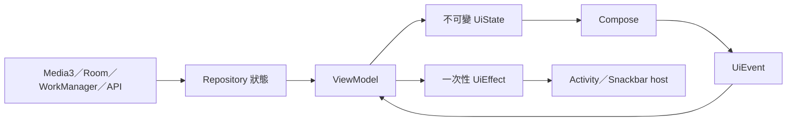
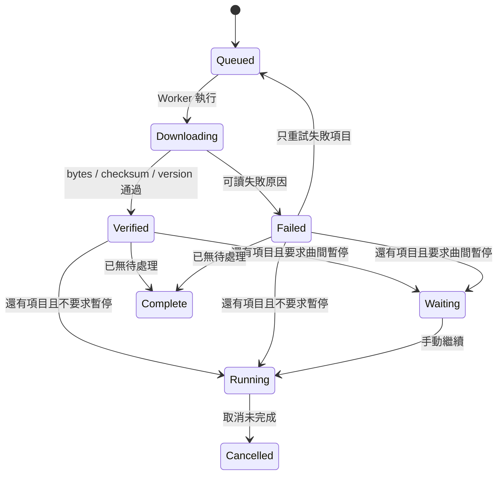

# 狀態、導航及邊界

## UDF

`PersistentList`／`PersistentMap` 儲存 UI 集合，沒有用 `@Immutable` 遮掩可變容器。播放器位置只經 `PlaybackProgress` 更新；每幀黑膠角度只在 `graphicsLayer` 讀取。UiState 內不存 Token、Android Player、Context、可變集合或導航控制器。

完整定義在 `domain/Models.kt`：AppUiState、AppSettingsUiState、LocalLibraryUiState、LibrarySearchUiState、PlaylistDetailUiState、NowPlayingUiState、VinylPresentationState、LyricsUiState、PlaybackQueueUiState、EqualizerUiState、SleepTimerUiState、DriveLibraryUiState、DownloadManagerUiState、LeaderboardUiState、ListenBrainzUiState、DiscoverUiState、StorageUiState。操作事件亦在同檔案。

## 黑膠工作階段

`VinylClock` 屬於 Application 持有的播放 Repository，不屬於某首歌。其狀態包括角度、單調錨點、每秒 15 度、引擎 isPlaying、可見及動畫允許旗標。停播／緩衝／隱藏前先計算當前角度，再清除錨點；恢復時以目前單調時間建立新錨點。換歌不呼叫 reset，也沒有 track ID key。隱藏期間不追補圈數。

關閉 App 程序後，角度重新開始，不嘗試套用上一個程序的單調時間。隊列、播放位置與設定獨立持久化。這個取捨避免不正確跨程序時間錨點；同一程序內的收合、歌詞、換曲與重組保持角度。

## 搜尋

`tab + query + generation` 形成請求識別。每次输入取消舊 Job，立即發布帶新識別且無舊結果的 Loading 狀態；文字輸入等待 200ms，Tab 切換立即搜尋。結果提交再比對完整識別。正規化採 Unicode NFKC、Locale.ROOT lowercase、空白合併。

歌曲只回傳 Track，另外三個 Tab 只回傳各自 GroupItem。歷史只在提交或選擇歌曲／分組時保存；按 Tab 分開，去重後最多 10 筆。

## 隊列與下載

每個 QueueEntry 擁有 UUID，因此同歌可以加入多次。Media3 moveMediaItem 保持目前位置；移除目前歌曲會標示延後處理，等離開該項目或本曲結束。Undo 保留原 entry ID。

等待時關閉曲間暫停只改偏好，不啟動 Worker。最後一首不進入 Waiting。關閉 Sheet 不取消工作。過程檔案為 `.part`；永久完成檔為 `.audio`。串流 cache 目錄與永久 offline 目錄完全分開。

## 統計

實際聆聽只用單調時間差，完全不使用播放位置差，因此 seek 不灌水。服務狀態轉換時先結算上一段。保留時間片與獨立計次事件；排行榜以 `[start, endExclusive)` 計算時間片交集，播放次數歸達標時刻。

本機門檻 `min(30s, duration/2)`；未知長度 30s。ListenBrainz 門檻獨立為 `min(240s, duration/2)`，未知長度 240s。預設統計時區 Asia/Hong_Kong；用日曆邊界處理 DST，週期更新不刪除歷史。

## 外部服務誠實性

沒有啟用 Google OAuth build flag 時顯示配置说明。ListenBrainz 必須實際驗證 Token；沒有推薦／沒有配對音源都顯示明確狀態。網絡錯誤不等同憑證無效。單元測試的資料與測試音訊不構成任何外部服務整合成功證據。
